# AI Routine Generation Flow - Sequence Diagram

This diagram shows the detailed AI integration flow for practice routine generation, including OpenAI service interaction, prompt engineering, and fallback mechanisms.

## System Components

- **AssessmentAnalyzer**: Creates structured datasets from assessment results
- **PracticeGenerationService**: Orchestrates routine generation with fallbacks
- **OpenAIService**: Direct API integration with OpenAI GPT-4o-mini
- **LoggerService**: Performance monitoring and error tracking
- **RoutinesProvider**: Receives and manages generated routines

## Assessment Data Structure

```json
{
  "sessionId": "uuid",
  "userId": "user_id", 
  "userLevel": "beginner|intermediate|advanced",
  "completedAt": "2024-01-15T10:30:00Z",
  "exercises": [
    {
      "type": "scale",
      "analysis": {
        "pitchAccuracy": 0.85,
        "timingConsistency": 0.78,
        "overallScore": 0.82
      }
    }
  ],
  "overallAssessment": {
    "strengths": ["pitch accuracy", "breath control"],
    "weaknesses": ["timing consistency", "articulation"],
    "recommendations": ["metronome practice", "articulation studies"]
  }
}
```

## Sequence Diagram

```mermaid
sequenceDiagram
    participant AA as AssessmentAnalyzer
    participant PGS as PracticeGenerationService
    participant OAI as OpenAIService
    participant OpenAI as OpenAI API
    participant LS as LoggerService
    participant RP as RoutinesProvider

    Note over AA, RP: Assessment Data Processing
    
    AA->>AA: Analyze assessment session
    AA->>AA: Calculate performance metrics
    AA->>AA: Identify strengths and weaknesses
    AA->>AA: Determine user skill level
    AA->>PGS: Return AssessmentDataset
    
    Note over AA, RP: Practice Routine Generation Orchestration
    
    PGS->>LS: Log generation start with dataset summary
    PGS->>PGS: validateDataset(dataset)
    
    alt Dataset validation successful
        PGS->>OAI: generatePracticePlan(dataset)
    else Dataset validation failed
        PGS->>LS: Log validation failure
        PGS->>PGS: Return fallback routines
        PGS->>RP: Return fallback practice routines
    end
    
    Note over AA, RP: OpenAI Service Integration
    
    OAI->>LS: Log AI generation attempt
    OAI->>OAI: Check service initialization
    
    alt OpenAI service not initialized
        OAI->>LS: Log initialization error
        OAI->>PGS: Throw service exception
        PGS->>PGS: Generate fallback routines
    else Service ready
        OAI->>OAI: Build structured prompt
    end
    
    Note over OAI: Prompt Engineering
    OAI->>OAI: Create system prompt with music education context
    OAI->>OAI: Add user performance data
    OAI->>OAI: Specify JSON response format
    OAI->>OAI: Include difficulty adjustment instructions
    OAI->>OAI: Add fallback exercise types
    
    Note over OAI: API Interaction
    OAI->>LS: Log API call start with prompt summary
    OAI->>OpenAI: POST /chat/completions
    Note over OpenAI: Model: gpt-4o-mini<br/>Temperature: 0.7<br/>Max Tokens: 2000
    
    alt API call successful
        OpenAI-->>OAI: JSON response with practice routines
        OAI->>LS: Log successful API response
        OAI->>OAI: Parse JSON response
        
        alt JSON parsing successful
            OAI->>OAI: Validate routine structure
            OAI->>OAI: Create PracticeRoutine objects
            OAI->>LS: Log successful routine creation
            OAI->>PGS: Return generated routines
        else JSON parsing failed
            OAI->>LS: Log parsing error with raw response
            OAI->>PGS: Throw parsing exception
            PGS->>PGS: Generate fallback routines
        end
        
    else API call failed
        OpenAI-->>OAI: API error (timeout, quota, etc.)
        OAI->>LS: Log API error with details
        OAI->>PGS: Throw API exception
        PGS->>PGS: Generate fallback routines
    end
    
    Note over AA, RP: Routine Difficulty Adjustment
    
    PGS->>PGS: adjustRoutineDifficulty(routines, userLevel)
    
    loop For each routine
        alt User level is beginner
            PGS->>PGS: Simplify exercises, reduce tempo
            PGS->>PGS: Add more guidance notes
        else User level is intermediate  
            PGS->>PGS: Standard difficulty, moderate tempo
        else User level is advanced
            PGS->>PGS: Increase complexity, faster tempo
            PGS->>PGS: Add technical challenges
        end
        
        PGS->>PGS: Add persistence metadata (ID, timestamps)
        PGS->>PGS: Set isAIGenerated flag appropriately
    end
    
    Note over AA, RP: Fallback Routine Generation
    
    alt AI generation failed at any point
        PGS->>LS: Log fallback activation
        PGS->>PGS: _generateFallbackRoutines(dataset)
        
        alt Dataset shows timing issues
            PGS->>PGS: Create timing-focused routine
        end
        
        alt Dataset shows pitch issues  
            PGS->>PGS: Create pitch-focused routine
        end
        
        PGS->>PGS: Always add basic technique routine
        PGS->>PGS: Add scale routine if not present
        PGS->>PGS: Adjust all routines for user level
        PGS->>LS: Log fallback routine creation
    end
    
    Note over AA, RP: Final Routine Delivery
    
    PGS->>LS: Log generation completion with routine count
    PGS->>RP: Return final practice routines
    RP->>RP: Store routines with AI generation metadata
    RP->>RP: Trigger persistence to Firestore
    
    Note over AA, RP: Error Handling Scenarios
    
    alt OpenAI quota exceeded
        OpenAI-->>OAI: 429 Rate limit exceeded
        OAI->>LS: Log quota error with retry suggestion
        OAI->>PGS: API exception
        PGS->>PGS: Use enhanced fallback routines
        PGS->>RP: Return fallback with quota notice
    end
    
    alt Network connectivity issues
        OpenAI-->>OAI: Network timeout
        OAI->>LS: Log connectivity error
        OAI->>PGS: Network exception
        PGS->>PGS: Use cached/fallback routines
        PGS->>RP: Return offline routines
    end
    
    alt Malformed AI response
        OpenAI-->>OAI: Invalid JSON structure
        OAI->>LS: Log malformed response with content
        OAI->>OAI: Attempt response repair
        
        alt Repair successful
            OAI->>PGS: Return repaired routines
        else Repair failed
            OAI->>PGS: Parsing exception
            PGS->>PGS: Use fallback routines
        end
    end
    
    alt OpenAI service degraded
        OpenAI-->>OAI: Slow response or partial failure
        OAI->>LS: Log performance degradation
        OAI->>OAI: Set shorter timeout for next call
        OAI->>PGS: Return available routines
        PGS->>PGS: Supplement with fallback if needed
    end
```



## AI Integration Features

### 1. Intelligent Prompt Engineering
- **Context-Aware Prompts**: Include user performance data and music education context
- **Structured Output**: JSON schema specification for consistent responses
- **Adaptive Difficulty**: Prompts adjust based on assessed skill level
- **Fallback Instructions**: AI guided to provide alternative exercises

### 2. Robust Error Handling
- **Service Validation**: Check OpenAI service availability before API calls
- **Response Parsing**: Comprehensive JSON validation with repair attempts
- **Quota Management**: Handle rate limits and usage quotas gracefully
- **Network Resilience**: Timeout handling and retry mechanisms

### 3. Fallback Strategy
- **Assessment-Based Fallbacks**: Generate routines based on identified weaknesses
- **Skill-Level Appropriate**: Fallback routines adjust to user's assessed level
- **Comprehensive Coverage**: Always include fundamental technique and scale work
- **Quality Assurance**: Fallback routines are professionally designed exercises

### 4. Performance Monitoring
- **Detailed Logging**: Track AI service performance and success rates
- **Response Analysis**: Monitor AI response quality and parsing success
- **Error Classification**: Categorize failures for targeted improvements
- **Usage Analytics**: Track API usage patterns and optimization opportunities

## OpenAI Integration Configuration

### API Parameters
- **Model**: `gpt-4o-mini` (cost-effective, fast responses)
- **Temperature**: `0.7` (balanced creativity and consistency)
- **Max Tokens**: `2000` (adequate for comprehensive routines)
- **Timeout**: `30 seconds` (balance speed and reliability)

### Prompt Structure
1. **System Context**: Music education expert persona with saxophone specialty
2. **User Data**: Assessment results, skill level, identified areas for improvement
3. **Output Format**: Detailed JSON schema for practice routines
4. **Quality Guidelines**: Exercise difficulty, duration, and progression rules
5. **Fallback Instructions**: Alternative approaches when primary analysis insufficient

### Quality Assurance
- **Response Validation**: Verify all required fields and data types
- **Content Filtering**: Ensure appropriate difficulty and realistic durations
- **Metadata Enhancement**: Add timestamps, IDs, and generation source tracking
- **User Context**: Incorporate user ID and assessment session information