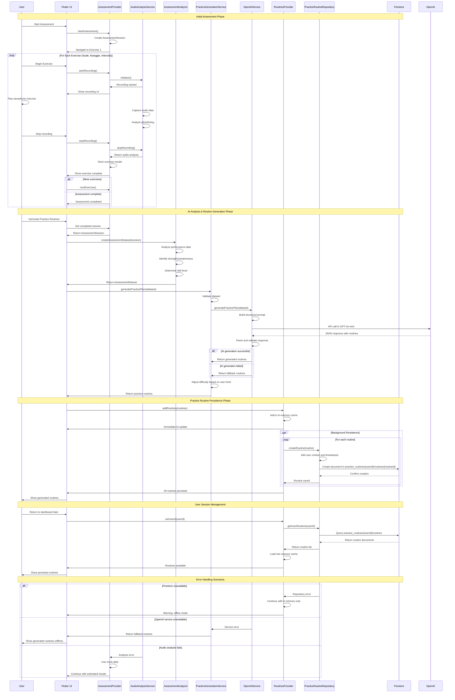

# Assessment to Practice Routine Flow - Sequence Diagram

This diagram shows the complete interaction flow from initial assessment through AI-powered analysis to practice routine generation and persistence.

## System Components

- **User**: The saxophone player using the app
- **UI**: Flutter user interface components
- **AssessmentProvider**: Manages assessment state and audio recording
- **AudioAnalysisService**: Processes recorded audio for pitch/timing analysis  
- **AssessmentAnalyzer**: Creates structured dataset from assessment results
- **PracticeGenerationService**: Orchestrates practice routine generation
- **OpenAIService**: Interfaces with OpenAI GPT-4o-mini for routine generation
- **RoutinesProvider**: Manages practice routine state and persistence
- **PracticeRoutineRepository**: Handles Firestore CRUD operations
- **Firestore**: Cloud database for routine persistence

## Sequence Diagram

## Key Interaction Points

### 1. Assessment Data Collection
- **Real-time Audio Analysis**: Live pitch and timing detection during exercises
- **Progressive Exercise Flow**: Scale → Arpeggio → Intervals with state management
- **Error Recovery**: Graceful handling of audio permission and recording failures

### 2. AI-Powered Analysis
- **Structured Data Processing**: Assessment results converted to standardized dataset
- **Intelligent Prompting**: Context-aware prompts sent to OpenAI for routine generation
- **Fallback Mechanisms**: Sample routines available when AI service is unavailable

### 3. Practice Routine Persistence
- **Dual Storage Strategy**: Immediate in-memory updates with background Firestore persistence
- **User-Scoped Data**: Hierarchical Firestore collection structure per user
- **Offline Resilience**: App continues working when database is unavailable

### 4. State Management Flow
- **Provider Pattern**: Reactive UI updates through ChangeNotifier providers
- **Dependency Injection**: Services injected through get_it container
- **Error Propagation**: Structured error handling with user-friendly messaging

## Data Flow Summary

1. **Assessment Input**: User performs saxophone exercises with real-time audio capture
2. **Analysis Processing**: Audio data analyzed for pitch accuracy and timing consistency  
3. **AI Generation**: Performance data sent to OpenAI for personalized routine creation
4. **Immediate Display**: Generated routines shown instantly in UI with in-memory caching
5. **Background Persistence**: Routines saved to Firestore for future sessions
6. **Session Recovery**: Persisted routines loaded automatically on app restart

## Technical Architecture Benefits

- **Scalable Design**: Repository pattern allows easy database switching
- **Offline Capability**: In-memory caching ensures app works without connectivity
- **Type Safety**: Dependency injection with compile-time service resolution
- **Error Resilience**: Multiple fallback layers for service failures
- **Performance**: Background persistence doesn't block UI interactions