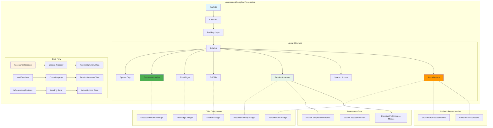

# Assessment Complete Presentation - Component Diagram

## Overview
The assessment complete presentation displays the success screen after finishing all assessment exercises, with results summary and action options.

## Component Structure



## Component Details

### Core Structure
- **Scaffold**: Root container with light background (`#FAFAFA`)
- **SafeArea**: Ensures content respects device safe areas
- **Column Layout**: Vertical arrangement with flexible spacing

### Layout Composition
1. **Top Spacer**: Pushes content toward center
2. **Success Animation**: Visual celebration of completion
3. **Title Section**: Main heading and subtitle
4. **Results Summary**: Assessment performance details
5. **Bottom Spacer**: Provides balanced spacing
6. **Action Buttons**: Primary navigation options

### Props Interface
```dart
final AssessmentSession? session;           // Assessment results data
final int totalExercises;                   // Total exercise count
final bool isGeneratingRoutines;            // Loading state flag
final VoidCallback onGeneratePracticeRoutine; // Generate routines action
final VoidCallback onReturnToDashboard;     // Return to dashboard
```

### Data Dependencies
```dart
// Results Summary
completedExercisesCount: session!.completedExercises.length
totalExercises: totalExercises
completedExercises: session!.completedExercises

// Action Buttons
onGeneratePracticeRoutine: callback
onReturnToDashboard: callback
isGeneratingRoutines: loading state
```

### Widget Dependencies
- `../widgets/success_animation.dart`
- `../widgets/title_widget.dart`
- `../widgets/sub_title.dart`
- `../widgets/results_summary.dart`
- `../widgets/action_buttons.dart`
- `../models/assessment_session.dart`

### User Interactions
- **Generate Practice Routine**: Triggers AI routine generation
- **Return to Dashboard**: Navigates back to main dashboard
- **Loading State**: Disables interactions during routine generation

### Layout Behavior
- **Centered Content**: Spacer widgets create balanced layout
- **Consistent Spacing**: 16px/32px gaps between sections
- **Full-screen**: Takes entire screen space
- **Responsive**: Adapts to different screen heights

### State Handling
- **Null Safety**: Handles optional AssessmentSession
- **Loading State**: Visual feedback during routine generation
- **Success State**: Celebration UI for completed assessment

### Assessment Session Data
```dart
session.completedExercises: List<Exercise>  // Completed exercise data
session.assessmentData: Map                 // Performance metrics
exercise performance metrics: pitch/timing  // Individual scores
```

### Visual Design
- **Success Theme**: Green animation and positive messaging
- **Clean Layout**: Minimal design with clear hierarchy
- **Action-oriented**: Prominent buttons for next steps
- **Professional**: Consistent with app design system

### State Management
- **Stateless**: Pure presentation component
- **Props-driven**: All data passed from parent container
- **Event-driven**: User actions handled via callbacks