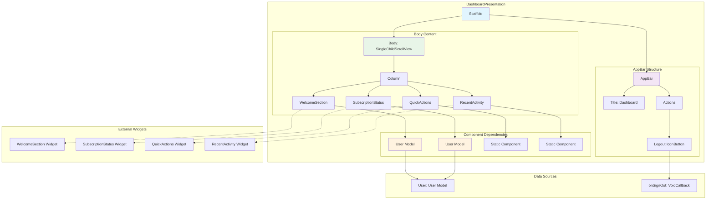

# Dashboard Presentation - Component Diagram

## Overview
The dashboard presentation serves as the main user interface after authentication, displaying user information, subscription status, and navigation actions.

## Component Structure



## Component Details

### Core Structure
- **Scaffold**: Root container with light gray background (`#FAFAFA`)
- **AppBar**: Branded header with logout functionality
- **SingleChildScrollView**: Ensures content scrollability on smaller screens

### AppBar Configuration
- **Background**: Primary brand color (`#2E5266`)
- **Title**: Centered "Dashboard" text in white
- **Actions**: Logout icon button with callback

### Content Sections
1. **Welcome Section**: Personalized greeting with user data
2. **Subscription Status**: Current subscription tier and trial info
3. **Quick Actions**: Primary navigation shortcuts
4. **Recent Activity**: Latest user actions and practice history

### Layout Structure
- **Vertical Column**: Sequential section arrangement
- **Consistent Spacing**: 24px/32px gaps between sections
- **Cross-axis Alignment**: Left-aligned content

### Data Dependencies
```
User Model → WelcomeSection & SubscriptionStatus
onSignOut Callback → AppBar Logout Button
```

### Widget Dependencies
- `widgets/welcome_section.dart`
- `widgets/subscription_status.dart`
- `widgets/quick_actions.dart`
- `widgets/recent_activity.dart`
- `../auth/models/user.dart`

### Props Interface
```dart
final User user;              // User data for personalization
final VoidCallback onSignOut; // Logout action handler
```

### State Management
- **Stateless**: Pure presentation component
- **Props-driven**: All data passed from parent container
- **Callback-based**: User actions delegated to parent