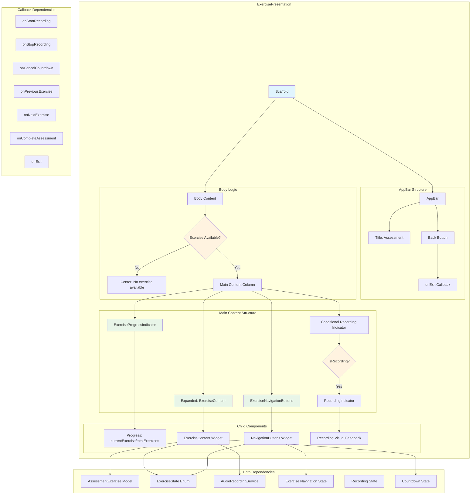

# Exercise Presentation - Component Diagram

## Overview
The exercise presentation manages the assessment flow with audio recording capabilities, exercise navigation, and real-time state updates.

## Component Structure



## Component Details

### Core Structure
- **Scaffold**: Root container with light background (`#FAFAFA`)
- **AppBar**: Assessment header with navigation
- **Conditional Body**: Handles null exercise states gracefully

### AppBar Configuration
- **Background**: Primary brand color (`#2E5266`)
- **Title**: Centered "Assessment" text
- **Navigation**: Back button triggers exit callback

### Content Flow
1. **Progress Indicator**: Shows current exercise position (X of Y)
2. **Recording Indicator**: Visual feedback when audio recording active
3. **Exercise Content**: Main exercise display and interaction area
4. **Navigation Buttons**: Previous/Next/Complete controls

### State Dependencies
```dart
AssessmentExercise? currentExercise;    // Current exercise data
ExerciseState exerciseState;            // Exercise completion state
int currentExerciseNumber;              // Progress tracking
int totalExercises;                     // Total exercise count
bool isRecording;                       // Audio recording state
int? countdownValue;                    // Recording countdown
AudioRecordingService audioService;     // Audio service injection
bool canGoToPreviousExercise;           // Navigation state
bool canGoToNextExercise;               // Navigation state
```

### Callback Interface
```dart
VoidCallback onStartRecording;          // Start audio recording
VoidCallback onStopRecording;           // Stop audio recording
VoidCallback? onCancelCountdown;        // Cancel recording countdown
VoidCallback? onPreviousExercise;       // Navigate to previous
VoidCallback? onNextExercise;           // Navigate to next
VoidCallback onCompleteAssessment;      // Complete assessment flow
VoidCallback onExit;                    // Exit assessment
```

### Widget Dependencies
- `../widgets/exercise_progress_indicator.dart`
- `../widgets/exercise_content.dart`
- `../widgets/exercise_navigation_buttons.dart`
- `../widgets/recording_indicator.dart`
- `../models/assessment_exercise.dart`
- `../models/exercise_state.dart`
- `AudioRecordingService`

### Layout Behavior
- **Responsive**: Adapts to different screen sizes
- **Conditional Rendering**: Shows/hides recording indicator
- **Safe Layout**: Handles null exercise states
- **Padded Content**: Consistent 24px horizontal padding

### State Management
- **Stateless**: Pure presentation component
- **Props-driven**: All state passed from parent container
- **Event-driven**: User interactions handled via callbacks