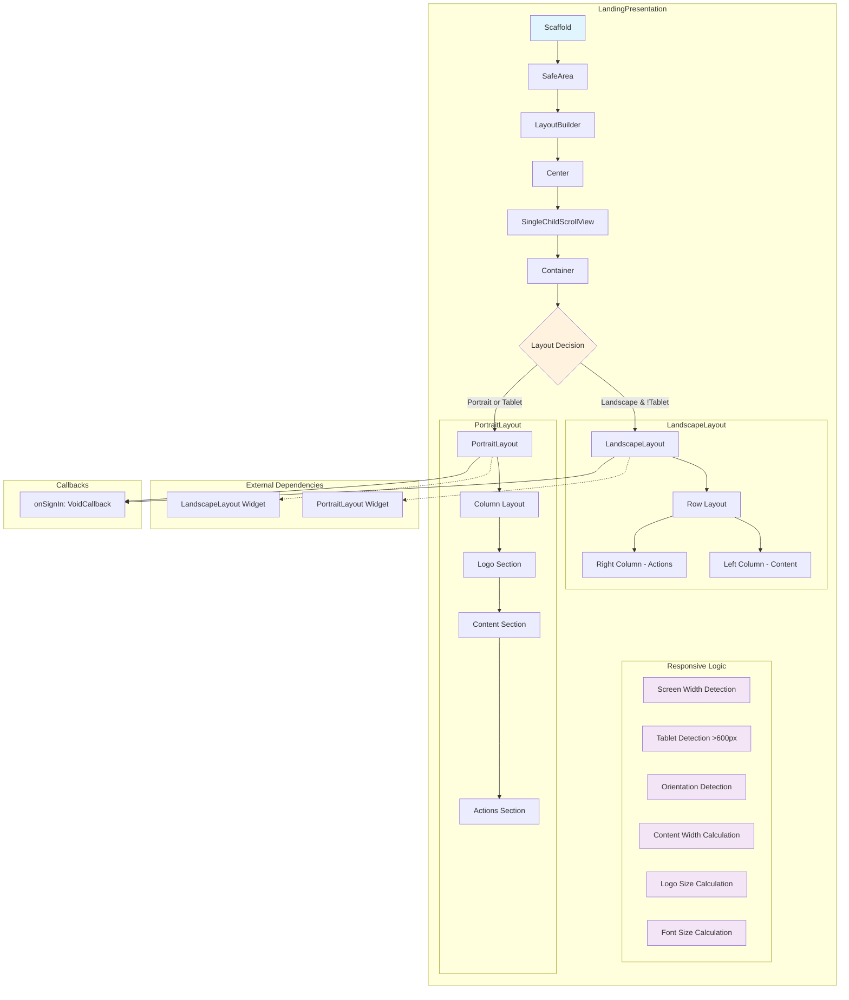

# Landing Presentation - Component Diagram

## Overview
The landing presentation implements a responsive authentication entry point with adaptive layouts for different screen orientations and device types.

## Component Structure



## Component Details

### Core Widget Structure
- **Scaffold**: Root container with background color `#FAFAFA`
- **SafeArea**: Ensures content respects device safe areas
- **LayoutBuilder**: Provides responsive constraints for adaptive layout
- **SingleChildScrollView**: Handles content overflow on smaller screens

### Responsive Logic
- **Device Detection**: Tablet threshold at 600px width
- **Orientation Detection**: Width vs height comparison
- **Content Width**: 60% of screen (400-600px) for tablets, full width for phones
- **Dynamic Sizing**: Logo (100px/140px), title (28px/36px), subtitle (16px/20px)

### Layout Variants
- **Portrait/Tablet**: Vertical column layout with centered content
- **Landscape Phone**: Horizontal row layout for space efficiency

### Data Flow
```
Props → Responsive Calculations → Layout Selection → Child Widget Rendering
```

### Dependencies
- `widgets/portrait_layout.dart`
- `widgets/landscape_layout.dart`
- Flutter Material Design components

### State Management
- **Stateless**: Pure presentation component
- **Props-driven**: All data passed via constructor
- **Callback-based**: User interactions handled via onSignIn callback