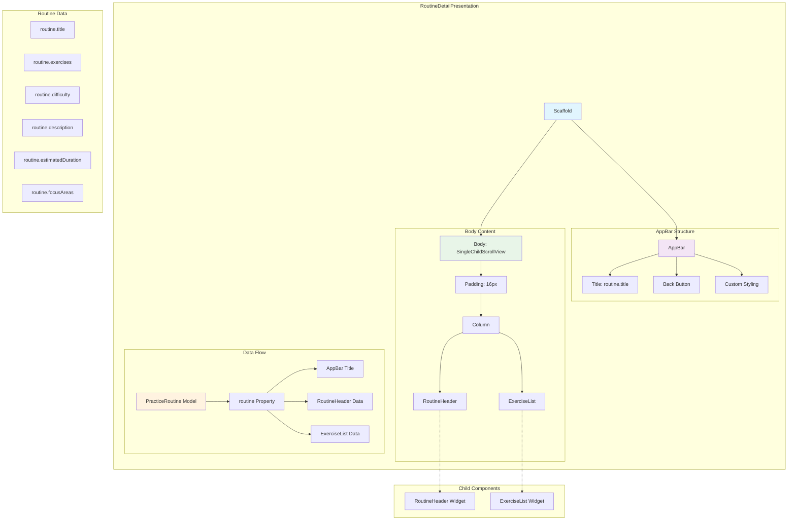

# Routine Detail Presentation - Component Diagram

## Overview
The routine detail presentation displays comprehensive information about a specific practice routine, including exercises and metadata.

## Component Structure



## Component Details

### Core Structure
- **Scaffold**: Root container with light gray background (`#F8F9FA`)
- **AppBar**: Dynamic title based on routine name
- **SingleChildScrollView**: Handles content overflow with consistent padding

### AppBar Configuration
- **Dynamic Title**: Displays `routine.title` with custom styling
- **Background**: Matches body background (`#F8F9FA`)
- **Foreground**: Brand color (`#2E5266`)
- **No Elevation**: Flat design with clean appearance

### Content Layout
1. **RoutineHeader**: Displays routine metadata and overview
2. **Spacing**: 24px gap between header and exercises
3. **ExerciseList**: Detailed exercise breakdown and instructions

### Props Interface
```dart
final PracticeRoutine routine;  // Complete routine data
```

### Widget Dependencies
- `../widgets/routine_header.dart`
- `../widgets/exercise_list.dart`
- `PracticeRoutine` model from practice feature

### Data Binding
```dart
// AppBar
title: Text(routine.title)

// Child Components
RoutineHeader(routine: routine)
ExerciseList(exercises: routine.exercises)
```

### Layout Specifications
- **Padding**: 16px uniform padding around content
- **Cross-axis Alignment**: Left-aligned content
- **Scrollable**: Vertical scrolling for long content
- **Responsive**: Adapts to different screen sizes

### PracticeRoutine Model Dependencies
- **title**: String - Routine name for AppBar
- **exercises**: List<Exercise> - Exercise data for ExerciseList
- **Additional fields**: Used by RoutineHeader component
  - difficulty level
  - estimated duration
  - focus areas
  - description

### State Management
- **Stateless**: Pure presentation component
- **Immutable**: Routine data passed as const parameter
- **Read-only**: No user interactions or state changes

### Visual Design
- **Typography**: Bold AppBar title with brand color
- **Spacing**: Consistent 24px gaps between sections
- **Background**: Light gray theme for content readability
- **Navigation**: Standard back button behavior