# Data Persistence Architecture - Sequence Diagram

This diagram shows the detailed data persistence architecture for practice routines, including the repository pattern, Firestore integration, and error handling.

## System Components

- **RoutinesProvider**: State management for practice routines (in-memory + persistence)
- **PracticeRoutineRepository**: Data access layer with CRUD operations
- **Firestore**: Cloud database with offline caching
- **LoggerService**: Comprehensive logging and performance monitoring
- **UI Components**: Flutter widgets consuming routine data

## Firestore Data Structure

```
practice_routines/
├── {userId}/
│   ├── routines/
│   │   ├── {routineId}/
│   │   │   ├── id: string
│   │   │   ├── userId: string
│   │   │   ├── title: string
│   │   │   ├── description: string
│   │   │   ├── targetAreas: string[]
│   │   │   ├── difficulty: string
│   │   │   ├── estimatedDuration: string
│   │   │   ├── exercises: PracticeExercise[]
│   │   │   ├── createdAt: timestamp
│   │   │   ├── updatedAt: timestamp
│   │   │   └── isAIGenerated: boolean
```

## Sequence Diagram

```mermaid
sequenceDiagram
    participant UI as Flutter UI
    participant RP as RoutinesProvider
    participant PRR as PracticeRoutineRepository
    participant FS as Firestore
    participant LS as LoggerService

    Note over UI, LS: User Authentication & Initialization
    
    UI->>RP: setUserId(userId)
    RP->>LS: Log user context set
    RP->>RP: Store userId for operations
    
    UI->>RP: loadUserRoutines()
    RP->>LS: Log routine loading start
    RP->>PRR: getUserRoutines(userId)
    
    PRR->>LS: Log performance start
    PRR->>FS: query practice_routines/{userId}/routines
    FS-->>PRR: Return routine documents
    PRR->>LS: Log performance metrics
    PRR->>RP: Return List<PracticeRoutine>
    
    RP->>RP: Clear in-memory cache
    RP->>RP: Add routines to cache
    RP->>RP: Sort by createdAt (most recent first)
    RP->>RP: Limit to maxRecentRoutines (10)
    RP->>UI: notifyListeners()
    UI->>UI: Rebuild with loaded routines
    
    Note over UI, LS: Creating New Practice Routine
    
    UI->>RP: addRoutines(generatedRoutines)
    RP->>RP: Add to in-memory cache immediately
    RP->>UI: notifyListeners() (immediate UI update)
    
    par Background Persistence
        loop For each routine
            RP->>RP: Create routine with userId context
            RP->>PRR: createRoutine(routine)
            
            PRR->>LS: Log creation start with metadata
            PRR->>PRR: Generate timestamps (createdAt, updatedAt)
            PRR->>FS: Set document at practice_routines/{userId}/routines/{routineId}
            
            alt Firestore success
                FS-->>PRR: Document created successfully
                PRR->>LS: Log success with performance metrics
                PRR->>RP: Creation confirmed
            else Firestore error
                FS-->>PRR: FirebaseException
                PRR->>LS: Log error with context
                PRR->>RP: RepositoryException
                RP->>LS: Log persistence failure
                Note over RP: Continue with in-memory storage
            end
        end
    end
    
    Note over UI, LS: Reading Specific Routine
    
    UI->>RP: getRoutineAt(index)
    RP->>UI: Return cached routine (fast)
    
    alt Need fresh data from server
        UI->>PRR: getRoutine(userId, routineId)
        PRR->>LS: Log fetch start
        PRR->>FS: Get document practice_routines/{userId}/routines/{routineId}
        
        alt Document exists
            FS-->>PRR: Return document data
            PRR->>PRR: Parse JSON to PracticeRoutine
            PRR->>LS: Log successful fetch
            PRR->>UI: Return PracticeRoutine
        else Document not found
            FS-->>PRR: Document doesn't exist
            PRR->>LS: Log not found
            PRR->>UI: Return null
        end
    end
    
    Note over UI, LS: Updating Existing Routine
    
    UI->>RP: updateRoutine(modifiedRoutine)
    RP->>RP: Update in-memory cache
    RP->>UI: notifyListeners()
    
    RP->>PRR: updateRoutine(routine)
    PRR->>LS: Log update start
    PRR->>PRR: Set updatedAt to current timestamp
    PRR->>FS: Update document with new data
    
    alt Update successful
        FS-->>PRR: Update confirmed
        PRR->>LS: Log successful update
        PRR->>RP: Update confirmed
    else Update failed
        FS-->>PRR: FirebaseException
        PRR->>LS: Log update error
        PRR->>RP: RepositoryException
        RP->>UI: Show error message
    end
    
    Note over UI, LS: Deleting Practice Routine
    
    UI->>RP: deleteRoutine(routineId)
    RP->>RP: Remove from in-memory cache
    RP->>UI: notifyListeners() (immediate UI update)
    
    RP->>PRR: deleteRoutine(userId, routineId)
    PRR->>LS: Log deletion start
    PRR->>FS: Delete document practice_routines/{userId}/routines/{routineId}
    
    alt Deletion successful
        FS-->>PRR: Document deleted
        PRR->>LS: Log successful deletion
        PRR->>RP: Deletion confirmed
    else Deletion failed
        FS-->>PRR: FirebaseException
        PRR->>LS: Log deletion error
        PRR->>RP: RepositoryException
        Note over RP: Keep removed from UI, log inconsistency
    end
    
    Note over UI, LS: Sync Operations
    
    UI->>RP: syncRoutines()
    RP->>LS: Log sync start
    RP->>PRR: getUserRoutines(userId)
    PRR->>FS: Fresh query from server
    FS-->>PRR: Latest routine data
    PRR->>RP: Return fresh routine list
    
    RP->>RP: Compare with in-memory cache
    RP->>RP: Identify differences (new, updated, deleted)
    RP->>RP: Update in-memory cache with server data
    RP->>LS: Log sync completion with diff summary
    RP->>UI: notifyListeners()
    
    Note over UI, LS: Error Handling Scenarios
    
    alt Network connectivity lost
        PRR->>FS: Firestore operation
        FS-->>PRR: Network error
        PRR->>LS: Log connectivity issue
        PRR->>RP: RepositoryException(network)
        RP->>RP: Continue with in-memory data
        RP->>UI: Show offline indicator
    end
    
    alt Firestore permissions denied
        PRR->>FS: Firestore operation
        FS-->>PRR: Permission denied error
        PRR->>LS: Log permission error
        PRR->>RP: RepositoryException(permissions)
        RP->>UI: Show permission error message
    end
    
    alt Data corruption/parsing error
        PRR->>FS: Get routine document
        FS-->>PRR: Malformed document data
        PRR->>PRR: JSON parsing fails
        PRR->>LS: Log parsing error with document data
        PRR->>RP: RepositoryException(parsing)
        RP->>UI: Show data error message
    end
```



## Key Persistence Features

### 1. Dual Storage Strategy
- **In-Memory Cache**: Immediate UI responsiveness with local state
- **Firestore Persistence**: Durable storage with offline capability
- **Background Sync**: Non-blocking persistence operations

### 2. Repository Pattern Benefits
- **Abstraction Layer**: Clean separation between data access and business logic
- **Type Safety**: Strongly typed operations with comprehensive error handling
- **Testability**: Easy to mock for unit testing
- **Maintainability**: Centralized data access logic

### 3. Error Handling Strategy
- **Graceful Degradation**: App continues working when persistence fails
- **Comprehensive Logging**: Detailed error context for debugging
- **User Feedback**: Clear error messages without technical details
- **Recovery Mechanisms**: Automatic retry and sync capabilities

### 4. Performance Optimizations
- **Lazy Loading**: Routines loaded only when needed
- **Efficient Queries**: User-scoped collections for fast retrieval
- **Caching Strategy**: Balance between memory usage and responsiveness
- **Batch Operations**: Multiple routine operations grouped for efficiency

## Data Consistency Guarantees

1. **Write Operations**: Always update in-memory cache first for immediate UI response
2. **Read Operations**: Serve from cache when possible, fetch from server when needed
3. **Conflict Resolution**: Server data takes precedence during sync operations
4. **Offline Handling**: Local changes preserved until connectivity restored
5. **Error Recovery**: Failed operations logged and can be retried manually